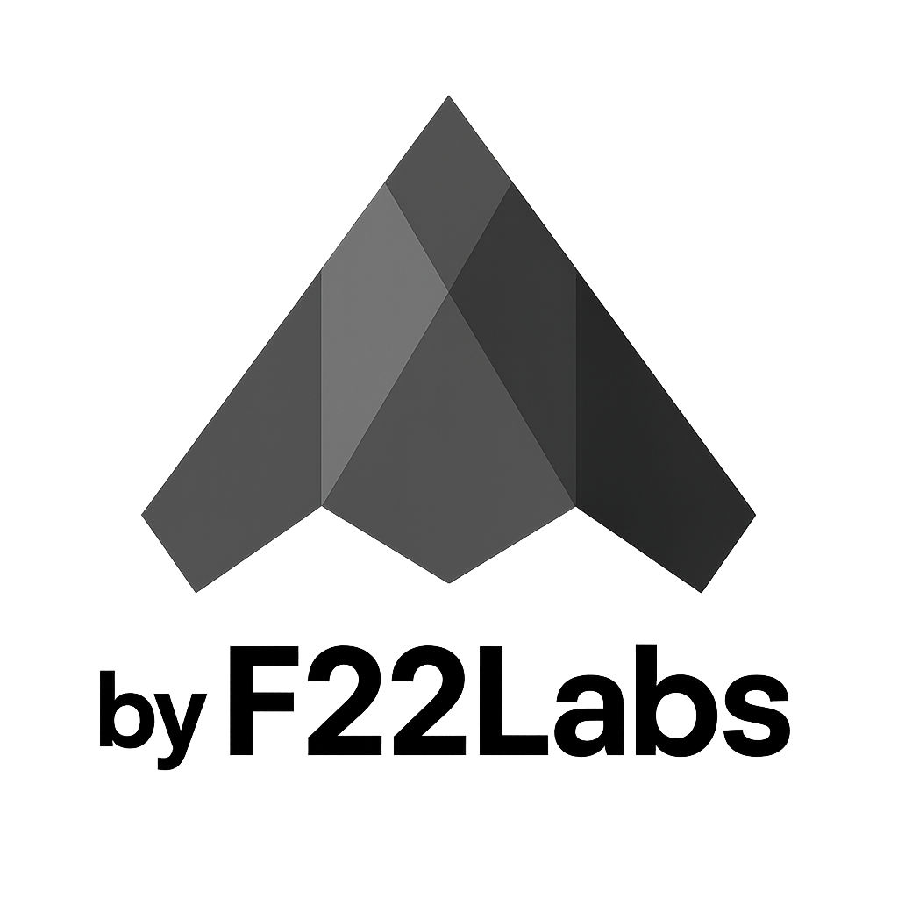

# 🤗 LLM Parameter Visualization App

This interactive application helps users visualize and understand the effects of key parameters (`temperature`, `top_p`, and `top_k`) on text generation using language models from Hugging Face.

 

## 🌟 Features

- **Interactive Parameter Control**: Adjust temperature, top_p, and top_k in real-time
- **Model Selection**: Use any text generation model from Hugging Face
- **Real-Time Text Generation**: See how parameter changes affect generated text
- **Save & Load Settings**: Store your preferred configurations for later use
- **Detailed Parameter Explanations**: Learn what each parameter does and how it affects generation

## 📋 Requirements

- Python 3.10+
- PyTorch
- Transformers
- Gradio
- Requests

## 🚀 Installation

1. Clone this repository:
   ```bash
   git clone https://github.com/krishna-f22/llm-parameter-visualization.git
   cd llm-parameter-visualization
   ```

2. Create a virtual environment using Python 3.10:

   ```bash
   python3.10 -m venv .venv
   ```

3. Activate the virtual environment:

   - On macOS/Linux:
     ```bash
     source .venv/bin/activate
     ```

   - On Windows:
     ```bash
     .venv\Scripts\activate
     ```

4. Install the required dependencies:

   ```bash
   pip install -r requirements.txt
   ```

## 💻 Usage

1. Run the application:
   ```bash
   python app.py
   ```

2. Open your web browser and navigate to `http://127.0.0.1:7860`

3. Enter a model name from Hugging Face, adjust the parameters, and see the generated text change in real-time.

## 🔍 Understanding the Parameters

### Temperature (0.1 - 2.0)

Temperature controls the randomness of the model's predictions. 

- **Low temperature** (e.g., 0.1-0.3): More deterministic and focused outputs. The model will more consistently choose the highest probability tokens.
- **Medium temperature** (e.g., 0.7-1.0): Balanced between deterministic and creative outputs.
- **High temperature** (e.g., 1.5-2.0): More random and diverse outputs. The model is more likely to choose lower probability tokens.

### Top-p / Nucleus Sampling (0.0 - 1.0)

Top-p sampling (also called nucleus sampling) sets a probability threshold and only considers tokens whose cumulative probability exceeds this threshold.

- **Low top-p** (e.g., 0.1-0.3): Only the most likely tokens are considered, resulting in more focused outputs.
- **Medium top-p** (e.g., 0.5-0.7): Balanced between focused and diverse outputs.
- **High top-p** (e.g., 0.9-1.0): Most tokens are considered, allowing for more diverse outputs.

### Top-k (1 - 100)

Top-k limits the set of tokens the model considers to the k highest probability tokens.

- **Low top-k** (e.g., 1-10): Very restrictive, considering only the most likely tokens, which increases coherence but limits creativity.
- **Medium top-k** (e.g., 20-50): Balanced between coherence and creativity.
- **High top-k** (e.g., 80-100): More tokens are considered, allowing for greater diversity in the output.

## 💾 Saving and Loading Settings

### Save Settings
1. Adjust parameters to your liking
2. Click "Save Current Settings" to store them locally
3. Use "Export Settings" to download a configuration file

### Load Settings
1. Click "Browse" in the "Import Settings" section
2. Select a previously exported settings file
3. Click "Load Imported Settings"

## 📁 Project Structure

```
llm-parameter-visualization/
├── app.py             # Main application file
├── README.md          # This documentation
└── locally_stored_model/  # Directory for saved settings and models
    ├── settings.json  # Saved parameter settings
    └── selected_model.txt  # Last used model name
```

## 🤝 Contributing

Contributions are welcome! Please feel free to submit a Pull Request.

1. Fork the repository
2. Create a feature branch (`git checkout -b feature/amazing-feature`)
3. Commit your changes (`git commit -m 'Add some amazing feature'`)
4. Push to the branch (`git push origin feature/amazing-feature`)
5. Open a Pull Request

## 📄 License

This project is licensed under the MIT License - see the LICENSE file for details.

## 🙏 Acknowledgements

- [Hugging Face](https://huggingface.co/) for their amazing transformers library
- [Gradio](https://gradio.app/) for the interactive UI framework
- [F22Labs](https://www.f22labs.com/) for their hardware and immense opportunities.